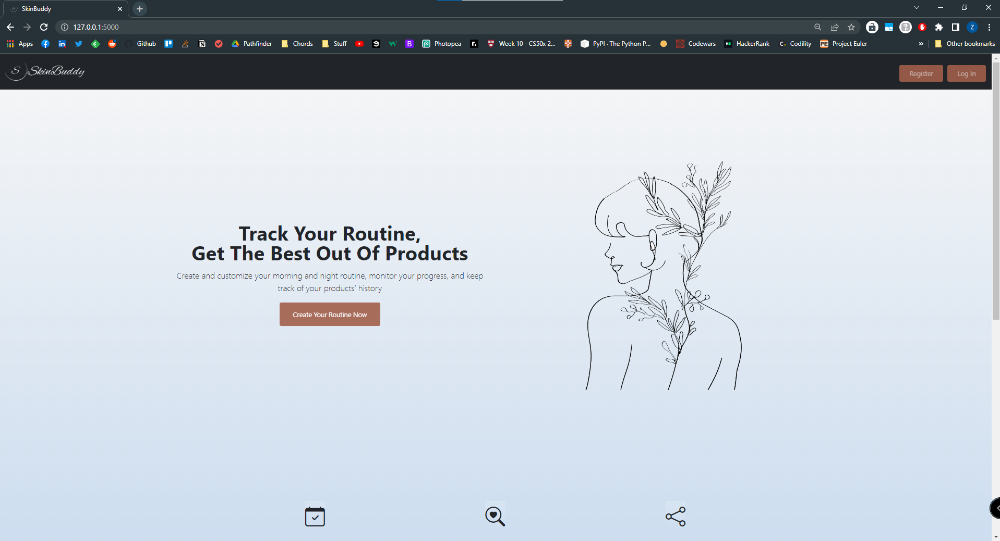
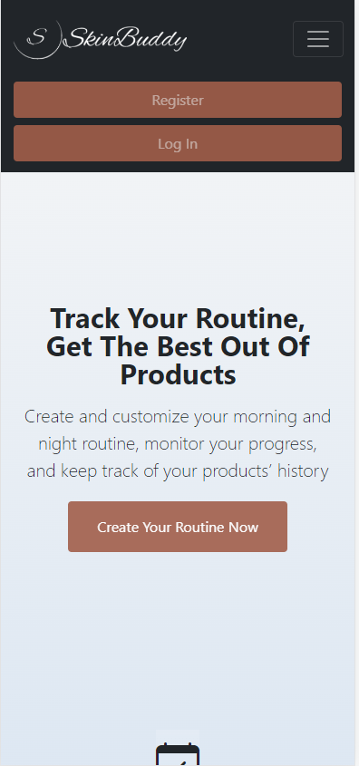

# SkinBuddy
### Video Demo:
[Watch the Demo Here](https://youtu.be/A3ujDORDE5U)

### Description:

SkinBuddy is a skincare routine web app that lets you add products to your morning and/or night routines, see detailed information about products, rate them as on your personal experience, and see your product history.

It's a personal project I've created, and I plan to continue to build on it as I improve myself. When I was learning the topics, I didn't want to follow online tutorials and create simple applications that have been made before thousand times. Hence, I started to think of something I would use in my life.

Skincare and clean ingredient products are in trend right now. People are more conscious about what is good for their skin and why. We need more than the one-type-fits-all solution. With this web app that's what I'm aiming for. I want to make people notice what they are using, and think about the topic.

I've used a database of approximately 2000 items that contain the product's brand name, product name, and ingredients.

### Technologies that are used in the project:

Front-End: HTML, CSS (Bootstrap 5), Javascript\
Back-End: Python with Flask\
DataBase: SQLite3

### Components of the Web Page:

- **Register Page:**\
The register page lets you create an account in which inputs are validated through the front-end and back-end.\
Password should contain at least 4 characters, 1 digit or more, 1 symbol or more, 1 uppercase letter or more, and 1 lowercase letter or more.

- **Login Page:**\
The login page lets you log into your account and start creating your morning and night routines.

- **Routine Page:**\
On Routine Page, you can search for products through brand name or product name and add it to your routine.\
You can see the ingredients of the products, and rate them according to how useful they've been to your skin.

- **Product History:**\
The product History page lets you track the changes in your routines.

### Illustrations:

It's a fully responsive web app.

Desktop View:\

Mobile View:\

